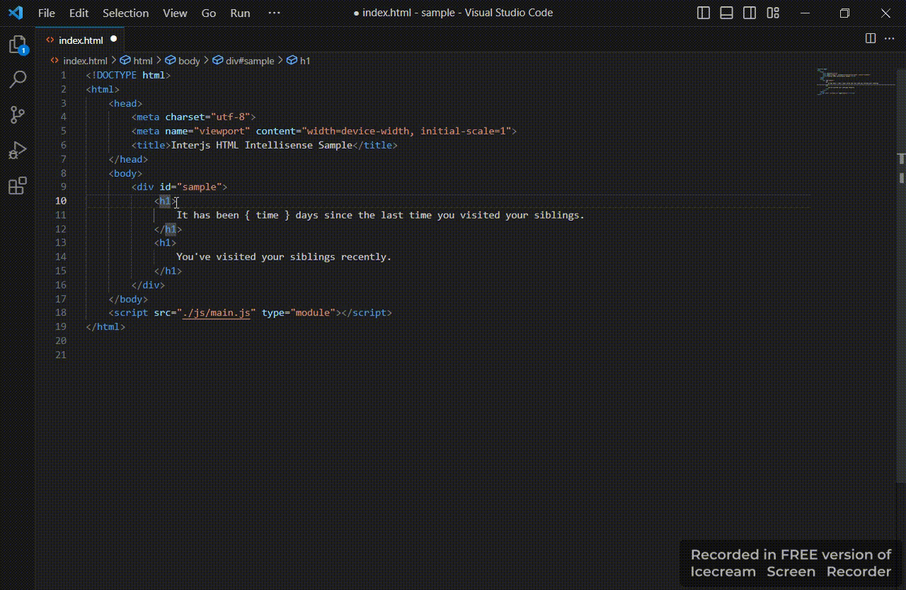

# Inter HTML Intellisense

By now, this extension aims to provide suggestions for Inter conditional attributes 
in HTML files.

When you run the following command in Vscode command palette, a message will pop up
informing you of the current extension version:

` Inter version`

The extension will be activated as soon as an HTML file is opened. You can Download it
from [Vscode market place](https://marketplace.visualstudio.com/items?itemName=interjs.inter-intellisense) or from [releases](https://github.com/interjs/inter-intellisense/releases) of this repository. Keep in mind that if you
download the extension from the releases, you have to install it directly in vscode.

