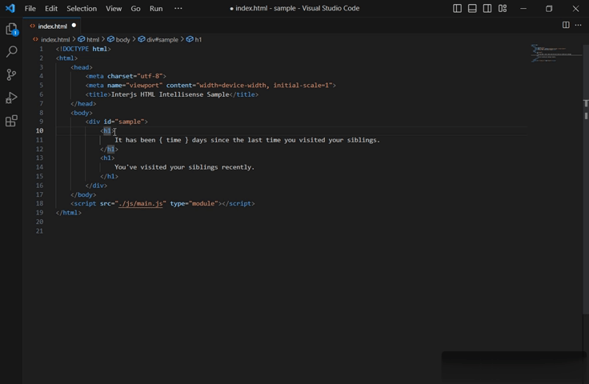

# Interjs HTML Intellisense

This extension aims to provide suggestions for Inter's HTML syntax.

To enable the extension to provide completions for references and conditional properties, you need to create the corresponding HTML comments in any area of the target document:

```html
<!--ref = reference1 reference2-->
<!--conditional = conditional1 conditional2-->
```

You should replace the placeholders 'reference1' and 'reference2' with the actual references' names used in the document, and do the same for the conditional properties.

`ref` and `conditional` are identifiers, the former is used for declaring the references' names, while the latter is used for declaring conditional properties' names.

When you run the following command in Vscode command palette, a message will pop up
informing you of the current extension version:

` Inter version`


The extension will be activated as soon as an HTML file is opened. You can Download it
from [Vscode market place](https://marketplace.visualstudio.com/items?itemName=interjs.inter-intellisense) or from [releases](https://github.com/interjs/inter-intellisense/releases) of this repository. Keep in mind that if you
download the extension from the releases, you have to install it directly in vscode.

Check out the video demos by clicking on: <a href="https://drive.google.com/file/d/1A7jAsGBVqXHis-RUyUvBnUiyvKarx4lp/view" target="_blank">video demo 1</a>
and <a href="https://drive.google.com/file/d/1MbJhBcWRnUbLmM5mSzi9fVcUXZBMZ7NL/view" target="_blank">video demo 2</a>.


